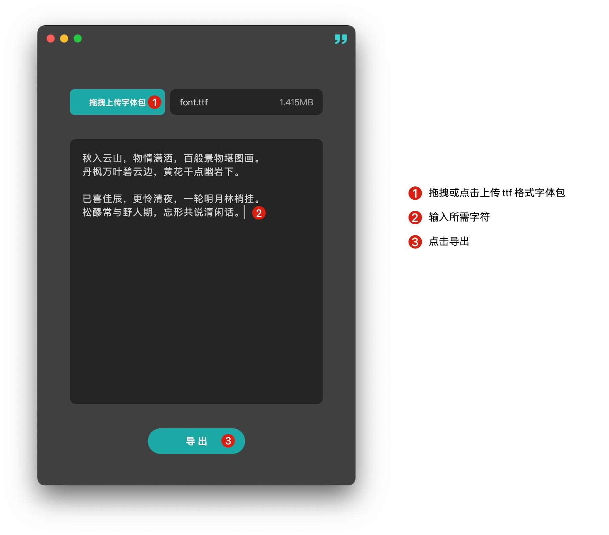
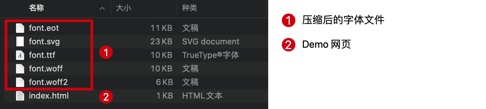

  

# Fontiny

Fontiny, 即 Font Tiny, 一款提供 **字体压缩提取** 的桌面端应用程序，支持 Windows & Mac OS

上传原始字体包，输入要保留的字符，即可导出提取压缩后的字体包及预览。

## Download 

前往 [Releases](https://github.com/simmzl/fontiny/releases) 下载最新版本安装包。

### Mac:

1. 如果提示来自不明开发者无法安装，需前往 `系统偏好设置` -> `安全性与隐私` -> `通用/安全性`，点击 `允许` 来自不明开发者的应用安装。
2. 如果出现文件损坏无法打开提示，可将 `Fontiny.app` 拖入 `应用程序` 文件夹中，然后 `Terminal` 中执行 `xattr -cr /Applications/Fontiny.app` 后再次打开即可。此问题是由于 Mac OS 系统对于应用签名的要求导致的。可以参考 [arm64 打开文件包损坏](https://github.com/lyswhut/lx-music-desktop/issues/1599#issuecomment-1773733551)
3. `Apple芯片` 请下载 `arm64.dmg` 版本，`Intel芯片` 请下载 `x64.dmg` 版本。

### Windows:

1. 下载 `win32-x64.zip` 版本，解压后即可使用。

## Usage

步骤说明：

- 上传ttf字体包
- 输入要保留的文字
- 导出压缩后的字体包
- 解压使用

**导出的文件：**

## License

[MIT](https://opensource.org/licenses/MIT)
