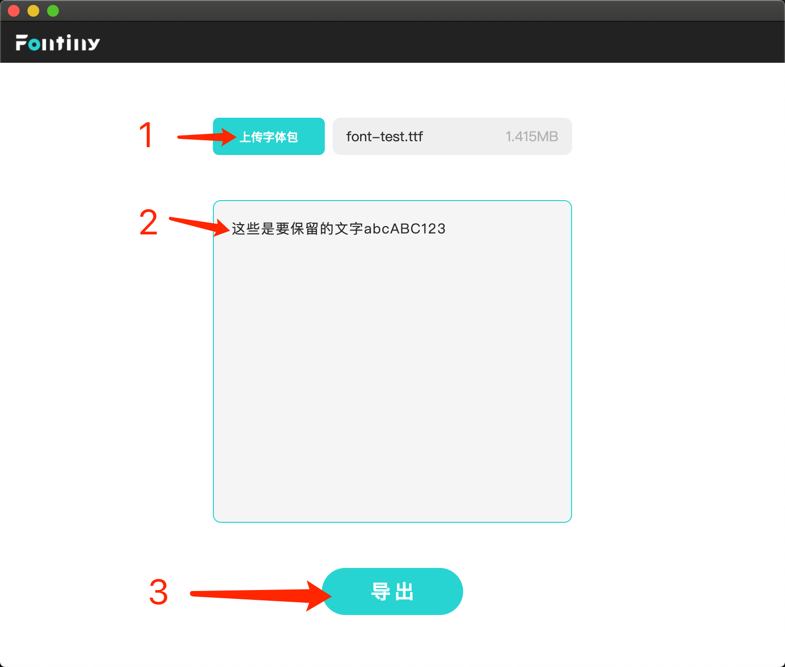
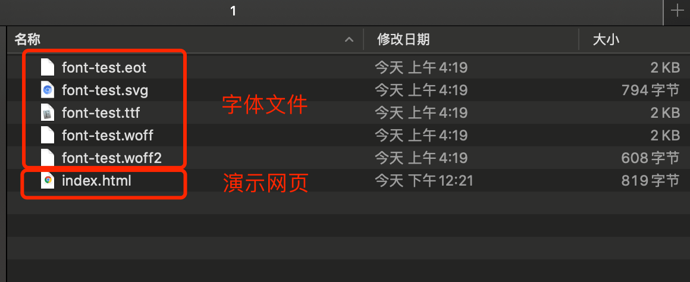

# Fontiny

一款提供**字体提取**的桌面端应用程序，支持 Windows & Mac OS

上传原始字体包，输入要保留的字符，即可导出提取后的字体包。

## Download 

[releases](https://github.com/simmzl/fontiny/releases)

## Install

Mac: 如果提示来自不明开发者无法安装，需前往 设置-安全性与隐私-通用 里同意安装：

## Usage

- 1.上传ttf字体包
- 2.输入要保留的文字
- 3.导出压缩后的字体包
- 4.解压使用

导出的文件：

## License

[MIT](https://opensource.org/licenses/MIT)
